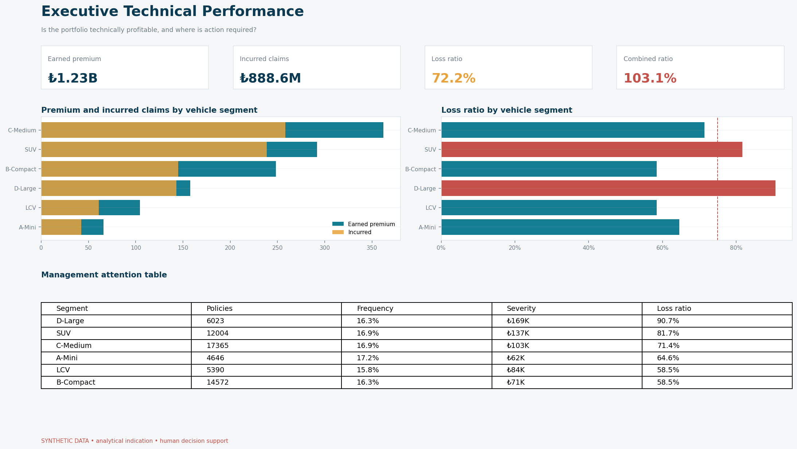
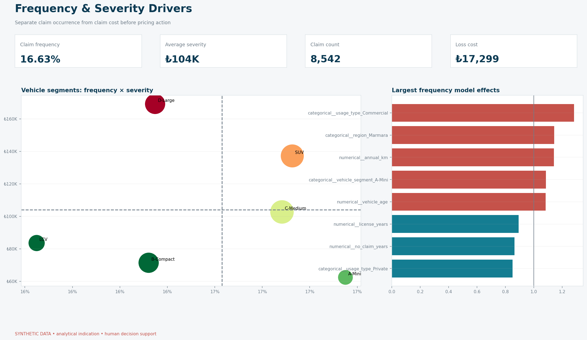
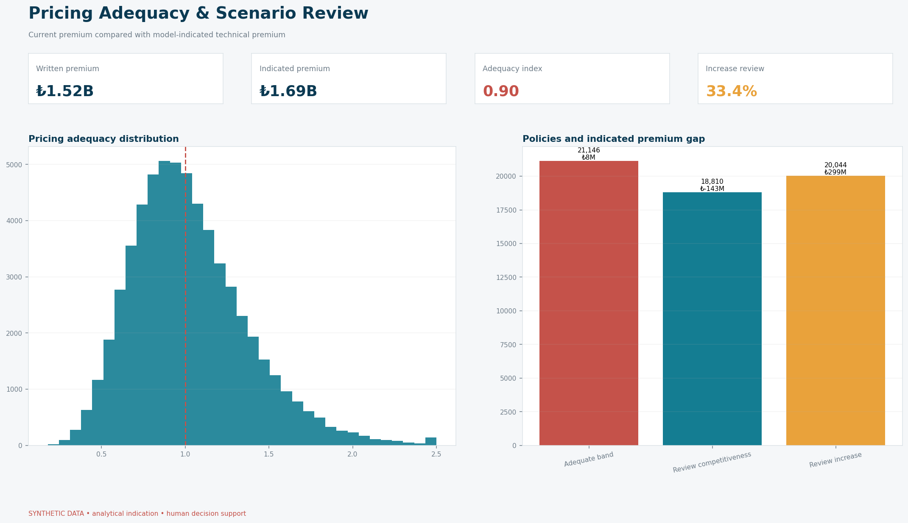
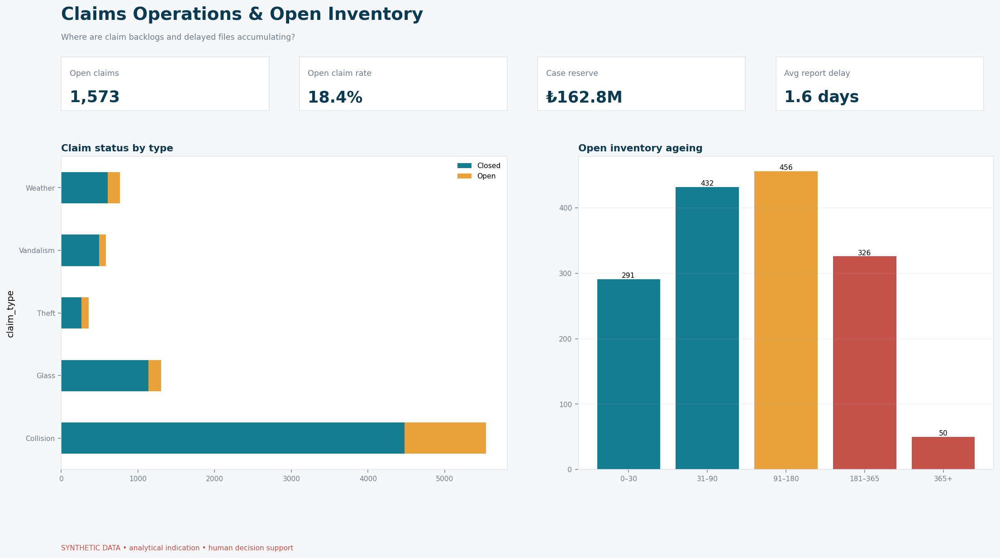
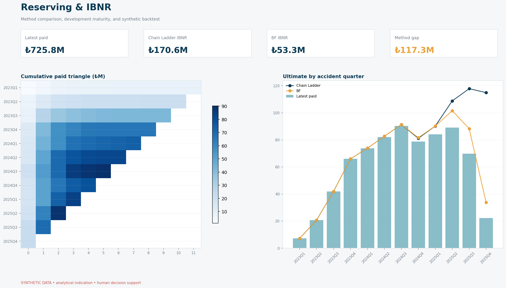
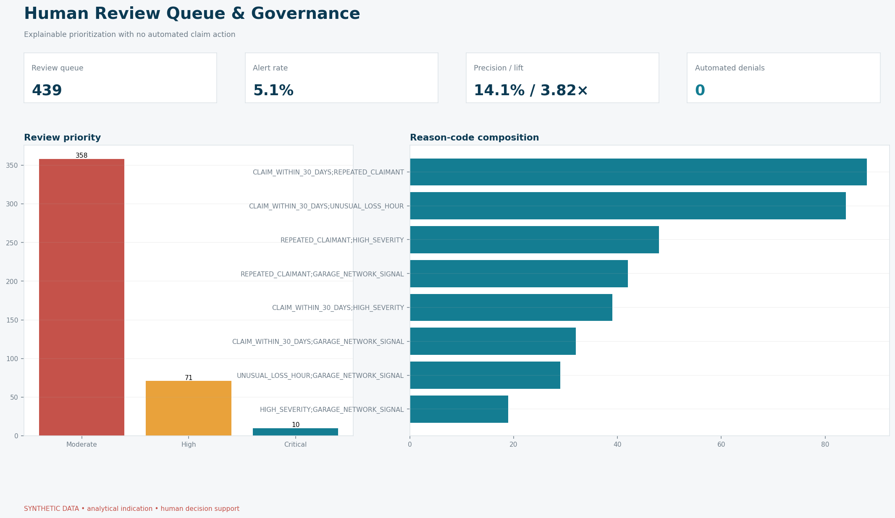
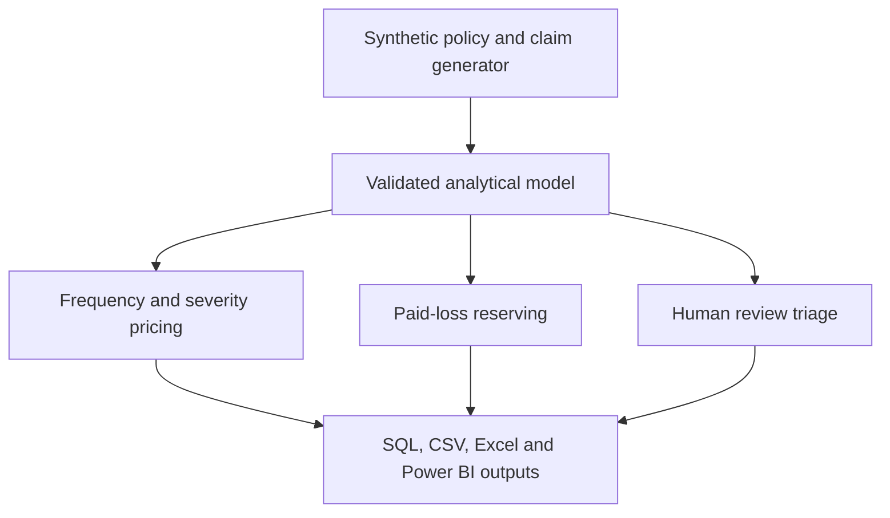
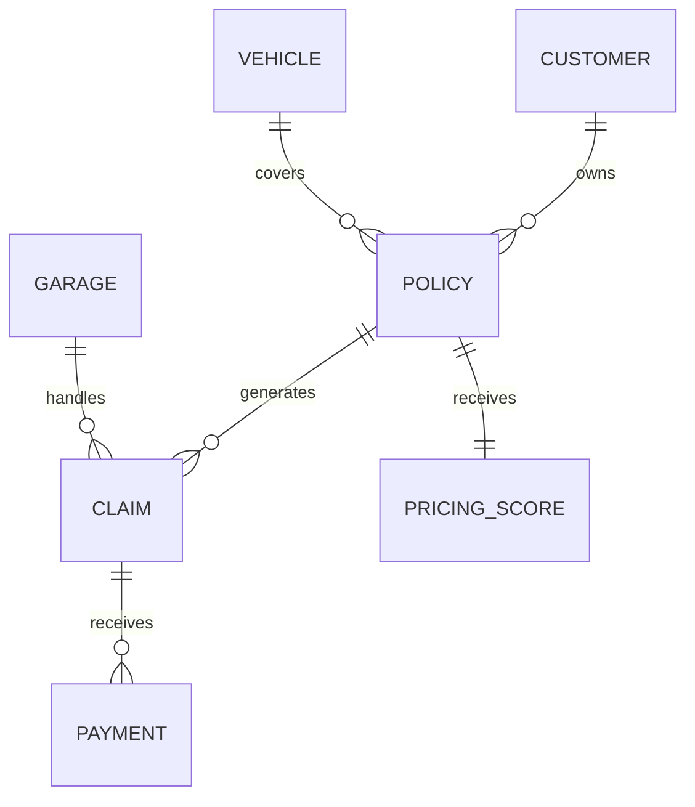

# Motor Insurance Technical Pricing, Claims & Reserving Analytics Platform

[Türkçe README](README.tr.md)

<p align="center">
  
</p>

<p align="center">
  <a href="https://www.python.org/"></a>
  <a href="https://powerbi.microsoft.com/"></a>
  <a href="https://www.postgresql.org/"></a>
  <a href="LICENSE"></a>
  
  
</p>

Portfolio-grade decision-support project for a fictional Turkish motor own-damage
insurer. It links exposure-aware claim-frequency modeling, positive-cost severity
modeling, technical premium indication, portfolio profitability, paid-loss
reserving, and explainable fraud triage in one reproducible workflow.

> Every customer, policy, vehicle, claim, payment, reserve, and fraud label is
> synthetic. The project is not approved for real pricing, underwriting,
> reserving, claim settlement, or adverse-action decisions.

## Business question

Which motor-insurance segments are underpriced, what drives claim cost, how much
unpaid-claim liability should be monitored, and which claims should be prioritized
for authorized human review?

## Verified deterministic run

The committed analytical outputs are generated with seed `20260902` and valuation
date `2025-12-31`.

| Evidence | Verified result |
| --- | ---: |
| Policies / exposure years | 60,000 / 51,365.60 |
| Claims / payment records | 8,542 / 14,570 |
| Earned premium | TRY 1.230B |
| Incurred claims | TRY 888.56M |
| Claim frequency | 16.63% |
| Average incurred severity | TRY 104,022.70 |
| Loss ratio / combined ratio | 72.23% / 103.08% |
| OOT frequency calibration | 0.982 actual-to-predicted |
| OOT pure-premium calibration | 0.866 actual-to-predicted |
| Policies flagged for indicated increase review | 33.60% |
| Chain Ladder IBNR | TRY 170.58M |
| Bornhuetter-Ferguson IBNR | TRY 53.28M |
| Human-review queue | 439 claims / 5.14% |
| Triage precision / lift | 14.12% / 3.82x |
| Automated claim denials | 0 |

The deterministic generator uses stable claim-development mechanics, so the
portfolio Chain Ladder error against synthetic ultimate losses is unusually low
at `0.01%`. This is a reproducibility benchmark, not an assertion of real-world
reserve accuracy. The Bornhuetter-Ferguson challenger underestimates synthetic
ultimate losses by `13.08%`, making the assumption risk visible instead of hiding it.

## Visual dashboard tour

The six-page report is organized around management decisions rather than isolated
charts. Every preview below is generated from the project's committed analytical
evidence.

<table>
  <tr>
    <td width="50%"><strong>1. Executive Technical Performance</strong><br></td>
    <td width="50%"><strong>2. Frequency &amp; Severity Drivers</strong><br></td>
  </tr>
  <tr>
    <td width="50%"><strong>3. Pricing Adequacy</strong><br></td>
    <td width="50%"><strong>4. Claims Operations</strong><br></td>
  </tr>
  <tr>
    <td width="50%"><strong>5. Reserving &amp; IBNR</strong><br></td>
    <td width="50%"><strong>6. Human Review &amp; Governance</strong><br></td>
  </tr>
</table>

> The images are static portfolio previews. `powerbi/DASHBOARD_SPEC.md` contains
> the exact page contracts, interactions, fields, measures, and decision cues for
> the interactive Power BI implementation.

## Decision modules

### 1. Technical performance

- Written and earned premium
- Paid, case reserve, and incurred claims
- Frequency, severity, loss ratio, and combined ratio
- Open-claim inventory and segment performance

### 2. Frequency and severity

- Poisson GLM using exposure-weighted annual claim frequency
- Gamma GLM using claim-count-weighted positive severity
- 2023–2024 development period and 2025 out-of-time validation
- Coefficient tables expressed on the log link and multiplicative scale

### 3. Technical pricing indication

- `Pure premium = predicted frequency × predicted severity`
- Expense- and channel-commission-adjusted indicated premium
- Adequacy index comparing current annual premium with indication
- Increase, adequate-band, and competitiveness review groups

### 4. Reserving

- Quarterly incremental and cumulative paid-loss triangles
- Volume-weighted age-to-age factors
- Chain Ladder ultimate and IBNR
- Bornhuetter-Ferguson expected-loss challenger
- Backtest against synthetic ultimate losses

### 5. Human-controlled fraud triage

- Short policy tenure, delayed reporting, repeated claimant, unusual loss hour,
  high severity, and garage-network reason codes
- Constrained review queue rather than automated claim action
- Precision, recall, and lift measured against synthetic truth
- Explicit human-review decision boundary on every scored record

## Architecture



## Data model



See [the data dictionary](docs/DATA_DICTIONARY.md) and the
[PostgreSQL reference schema](sql/schema.sql).

## Repository map

```text
.
├── config/                 # Seed, valuation, economics, and model assumptions
├── data/sample/            # Small reviewable samples; full raw data are generated
├── src/motor_insurance/    # Generation, KPI, pricing, reserving, triage, reporting
├── artifacts/              # Versioned aggregate evidence; large scores regenerate locally
├── reports/                # Executive summary and Excel analytical workbench
├── powerbi/                # Six-page dashboard package, data marts, theme and DAX
├── sql/                    # PostgreSQL star-like analytical model
├── docs/                   # Charter, dictionary, and governance boundary
├── tests/                  # Determinism, integrity, analytics, and control tests
└── scripts/run_pipeline.py # End-to-end entry point
```

## Quick start

```bash
python -m venv .venv
source .venv/bin/activate
python -m pip install -r requirements.txt
PYTHONPATH=src python scripts/run_pipeline.py
PYTHONPATH=src python -m unittest discover -s tests -v
```

For a fast development run:

```bash
PYTHONPATH=src python scripts/run_pipeline.py --n-policies 6000
```

## Key outputs

| Output | Purpose |
| --- | --- |
| `artifacts/run_manifest.json` | Reproducible run identity and verified metrics |
| `artifacts/pricing/policy_pricing_scores.csv` | Generated policy-level indication and adequacy review |
| `artifacts/pricing/*_coefficients.csv` | Explainable GLM factors |
| `artifacts/reserving/*triangle.csv` | Paid-loss development evidence |
| `artifacts/reserving/reserve_by_accident_quarter.csv` | Chain Ladder and BF comparison |
| `artifacts/fraud/claim_triage_scores.csv` | Reason-coded human-review prioritization |
| `reports/motor_insurance_analytics_workbench.xlsx` | Multi-sheet analytical workbench |
| `powerbi/measures.dax` | Shared KPI definition layer |
| `powerbi/DASHBOARD_SPEC.md` | Six decision-led report-page contracts |
| `powerbi/mockups/` | Six evidence-based 16:9 dashboard previews |

## Power BI portfolio report

The report package includes Executive Performance, Frequency & Severity,
Pricing Adequacy, Claims Operations, Reserving & IBNR, and Human Review &
Governance pages. Build the portable data marts and previews with:

```bash
python scripts/build_powerbi_assets.py
```

Then follow `powerbi/README.md` in Power BI Desktop. The repository supplies the
controlled inputs, relationship contract, DAX measures, theme, and page design.
Desktop owns and validates generated PBIP/PBIR/TMDL metadata.

## Governance controls

- No protected attributes are generated or modeled.
- Synthetic truth is isolated as evaluation evidence and is not a real-world feature.
- Triage can prioritize investigation but cannot reject or reduce a claim.
- Pricing and reserve results are indications requiring actuarial validation.
- Time-based validation is used instead of a random-only split.
- All material assumptions are controlled in `config/project.yaml`.

Read the full [model-governance note](docs/MODEL_GOVERNANCE.md).

## Turkish-sector alignment

The project uses public sector concepts and aggregate context—not confidential
records—from the [Insurance Association of Türkiye motor statistics](https://www.tsb.org.tr/tr/istatistik/motorlu-tasitlar-istatistikleri),
the [Insurance Information and Monitoring Center](https://www.sbm.org.tr/), and
SEDDK's [2026/27 insurance-fraud committee circular](https://www.seddk.gov.tr/UploadContent/Documents/2026-27%20say%C4%B1l%C4%B1%20Genelge.pdf).

## Author

Murat Miraç Gedik — Statistics, banking and insurance analytics, risk analytics,
and business intelligence.

### Analytical input and export controls

Portfolio KPI JSON export converts NumPy scalars to Python scalars before checking finiteness. Undefined or infinite floating-point metrics become JSON null; finite values and integer counts retain their values. This permits strict JSON serialization with allow_nan=False.
